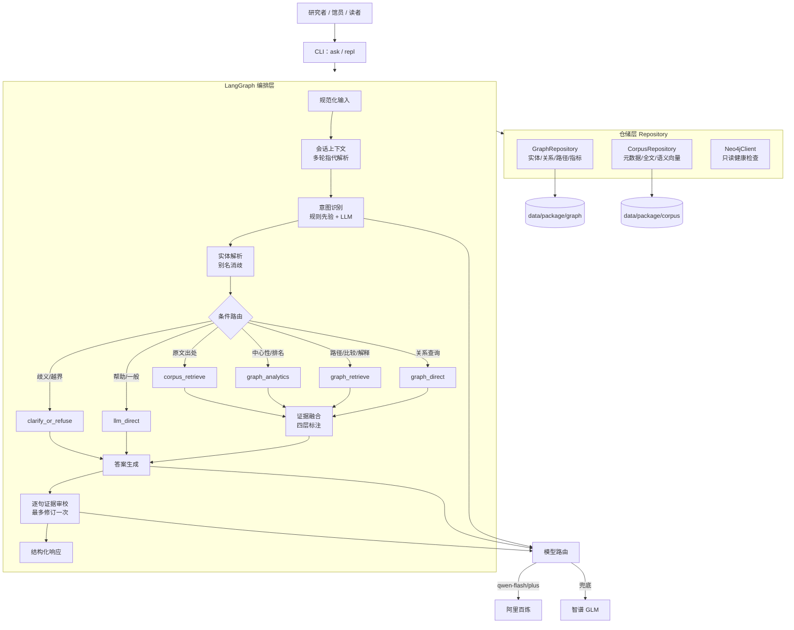
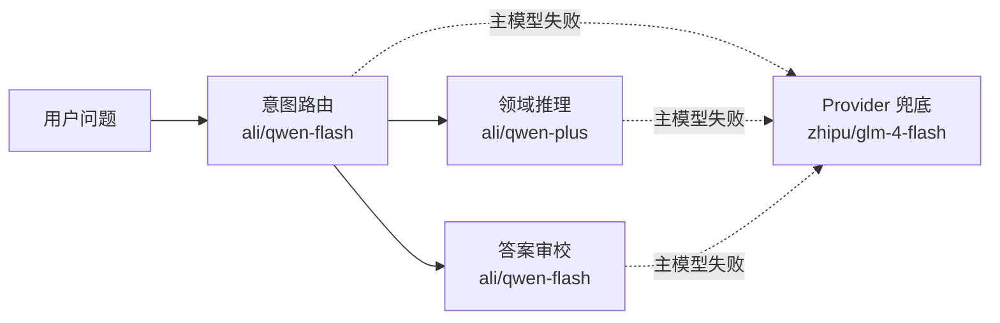

# 慧读星云

**基于 AI 知识图谱的《星云大师全集》人间佛教智能研析与知识服务平台**

面向高校图书馆特色馆藏活化的可追溯知识服务智能体：以意图路由为入口、以知识图谱与全文语料为工具、以 LLM 为解释器、以逐句证据审校为质量门控、以馆员复核为最终治理机制。**每一个领域结论都可回链到原文与图谱，证据不足时显式暴露覆盖边界，不让模型补造语料事实。**

## 系统架构



编排采用 **LangChain（模型适配/工具接口）+ LangGraph（条件路由/状态图）**，第一版为显式状态图而非自由 ReAct 循环，保证可解释、可审计。

## 核心功能（六条路由）

| 路由 | 意图 | 说明 |
|---|---|---|
| `graph_direct` | 直接关系查询 | 稳定关系 + 原文证据（A 层），如「星云大师连接了哪些机构」 |
| `graph_retrieve` | 实体解释 / 多跳路径 / 比较 | 图谱 + Claim + 全文混合，如「《维摩经》如何连接到人间佛教实践」 |
| `corpus_retrieve` | 原文 / 出处检索 | 语义向量召回 + 关键词精排（C 层），如「哪些文章谈到共生」 |
| `graph_analytics` | 图谱结构分析 | 冻结网络指标（桥接得分等）+ LLM 结构解释 |
| `llm_direct` | 系统帮助 / 一般表达 | 直接回答，明确标注不来自全集语料 |
| `clarify_or_refuse` | 实体歧义 / 越界 / 纠错 | 追问确认或说明边界 |

意图识别为三层机制：规则先验 → 实体/领域命中 → LLM 结构化分类（`qwen-flash`），规则强信号可纠正弱模型误判。

## 四层证据体系

领域结论必须至少落在 A/B/C 之一，LLM 只能依据证据包归纳，不得以背景知识补造语料事实。

| 层级 | 含义 | 来源 | 表达要求 |
|---|---|---|---|
| **A** | 稳定关系 + 原文 | 正式知识图谱稳定层 | 可作为结论主证据 |
| **B** | 语境命题（Claim）+ 原文 | Claim 语境层 | 用「在该语境中」「原文解释为」限定 |
| **C** | 全文检索线索 | 语义/关键词检索 | 标注「尚未进入图谱，谨慎采用」 |
| **D** | 一般知识 | LLM | 不得声称结论来自全集 |

「大师」不自动等同于「星云大师」——数据层将称谓（RoleTitle）与人物（Person）分离，规避指代合并带来的关系污染（呼应指代敏感性分析）。

## 模型路由



- **角色分级**：路由/审校用快模型（`qwen-flash`），推理用强模型（`qwen-plus`），降低端到端延迟。
- **Provider 级回退**：瞬时错误原地重试；硬错误/重试穷尽则切兜底 `glm-4-flash`；兜底也失败则降级为离线规则，不崩溃。
- **密钥不入工程**：真实密钥存放在工程目录外的 `../LLM api key.txt`，只解析具名条目，仅存内存，日志脱敏。

## 数据与规模

| 项 | 规模 |
|---|---|
| 全集正文 | 20,020 篇 / 105 册（只读，另附压缩包） |
| 实体 / 别名 | 25,560 / 43,632 |
| 关系类型 / 稳定关系 | 153 / 2,748 |
| 稳定证据 / 语境命题 | 3,514 / 4,250 |
| 质量（人工复核） | 稳定关系精度 94.19%（语义 96.39%）；Claim 忠实率 89.2% |

数据策略：规范化小数据（图谱/元数据）随仓库提交；大部头正文与向量索引**不入仓**，由构建脚本从冻结源重建（见 `docs/09_deployment_runbook.md`）。

## 快速开始

```powershell
# 1. 安装依赖（推荐用本机 Python 3.11/3.12）
pip install "langchain>=1.2,<2.0" "langgraph>=1.0,<2.0" langchain-openai langchain-deepseek \
    langchain-groq langchain-nvidia-ai-endpoints "numpy>=1.26" "sentence-transformers>=3.0" \
    neo4j "pydantic>=2.0,<3.0" pydantic-settings "pytest" "pytest-asyncio"

# 2. 配置模型（复制模板；真实密钥放工程外，见下）
copy .env.example .env
#   把 API Key 按 label 写入 ../LLM api key.txt（ali / zhipu / ...）

# 3. 基础校验（只读路径/数量/密钥标签，不打印任何密钥）
python scripts/validate_foundation.py

# 4. 在线能力探测（锁定可用的路由/兜底模型）
python scripts/probe_models.py --provider ali

# 5. 单次问答 / 交互 / 离线（无 LLM）模式
python -m huidu_xingyun.cli ask "星云大师在哪些文章中谈到共生？"
python -m huidu_xingyun.cli repl
python -m huidu_xingyun.cli ask --no-llm "什么是人間佛教"
python -m huidu_xingyun.cli ask --export "星云大师在当前稳定图中连接了哪些机构？"

# 6. 语义检索索引（20,020 篇，DashScope 嵌入；--local-bge 可离线回退）
python scripts/build_vector_index.py

# 7. 测试
python -m pytest -q
```

> 包采用扁平布局，直接在项目根目录运行 `python -m huidu_xingyun.cli …` 即可，无需 `pip install` 或 `PYTHONPATH`。若非要可安装打包，`pip install .`（非 editable）在中文路径下相对稳妥。

## 目录结构

```text
huidu-xingyun/
├─ config/                数据路径(data_paths.json)、模型角色(models.example.json)、字段契约(data_schema.json)
├─ huidu_xingyun/
│  ├─ config/             Settings / RuntimePaths / SecretLoader
│  ├─ schemas/           IntentResult / EvidenceItem / FinalResponse / AgentState ...
│  ├─ repositories/      GraphRepository / CorpusRepository / VectorStore / Neo4jClient / embeddings
│  ├─ models/            ModelFactory / 模型路由(router) / 重试(retry) / 缓存(cache) / 探测(probe)
│  ├─ tools/             @tool 接口抽象层（蓝图约定，链接入 LangGraph 前由仓储层承载）
│  ├─ agent/             nodes / routing / prompts / graph / pipeline / parsing
│  └─ cli.py             ask / repl 入口
├─ scripts/              validate_foundation / build_portable_data / build_vector_index / probe_models
├─ tests/                48 项离线测试
├─ data/package/         规范化运行数据（图谱/元数据入仓；正文另附）
├─ data/derived/         向量索引、探测报告（不入仓，可重建）
├─ docs/                 项目章程 / 数据契约 / 编排蓝图 / 模型策略 / 决策日志 / 工作日志 ...
├─ outputs/              证据包与演示导出（不入仓）
└─ runtime/              缓存与日志（不入仓）
```

## 安全边界

- 源数据一律只读；切片、向量、缓存、日志只写 `data/derived/`、`runtime/`、`outputs/`。
- 不自动修改知识图谱、不开放无限制 Text2Cypher、不把全文线索自动提升为稳定关系。
- 密钥不进入仓库与日志；`.env` 不入仓（模板见 `.env.example`）。

## 文档入口

1. `docs/00_project_charter.md` — 目标、范围、非目标与成功标准。
2. `docs/01_data_sources_and_contracts.md` — 权威数据源与字段契约。
3. `docs/02_agent_orchestration.md` — LangChain/LangGraph 编排蓝图。
4. `docs/03_model_and_secret_policy.md` — 模型路由与密钥管理。
5. `docs/04_working_document_architecture.md` — 工作文档维护规则。
6. `docs/05_decision_log.md` — 不可隐式更改的架构决策（ADR）。
7. `docs/06_work_log.md` — 阶段进展、验证结果与下一步。
8. `docs/07_portable_data_spec.md` — 数据包目录、编号与字段规则。
9. `docs/09_deployment_runbook.md` — 安装、配置、运行与数据重建。
10. `docs/10_competition_description.md` — 竞赛「作品建设说明书」草稿。
11. `docs/11_operation_guide.md` — 用户操作指南（怎么提问、怎么读结果、四层证据）。
12. `docs/12_agent_showcase.md` — Agent 功能展示（示例问答实录 + 证据层级 + 边界）。