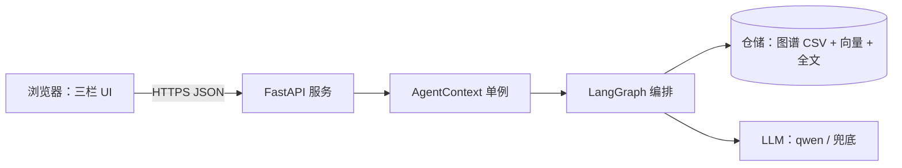

# 公开部署计划（13）

从「CLI 演示」走向「可通过链接/二维码访问的应用」的分阶段方案。当前前端未接入、无 API 层、无公网部署。

## 现状盘点

- ✅ 核心可运行：`python -m huidu_xingyun.cli` 开箱即用；六条路由 + 四层证据 + 模型路由/回退 + 语义检索 + 多轮 + 证据包导出；48 项测试。
- ✅ 数据就绪：小数据入仓，向量索引 `data/derived/vector_metadata/document_embeddings.npy` 可就地构建。
- ❌ 缺 API 层（`pyproject.toml` 已备 `api` extra：fastapi + uvicorn）。
- ❌ 缺前端（roadmap §12 三栏布局：左侧对话 + 右侧图谱 + 下方证据）。
- ❌ 缺公网部署与合规材料（等保/大模型备案以实际为准）。

## 目标架构

## 阶段 1：API 层（FastAPI）✅ 已实现

已落地 `huidu_xingyun/server/`（`python -m huidu_xingyun.server` 或
`uvicorn huidu_xingyun.server.app:app`）：

- `POST /api/v1/ask` — 入参 `{query, history?}`；返回 `FinalResponse`。
- `POST /api/v1/export` — 问答并导出 Markdown 证据包。
- `GET /api/v1/health` — 模型就绪 / 语料规模 / 图谱概览 / 向量索引存在性。
- `GET /api/v1/exports/{filename}` — 下载已导出证据包。
- `AgentContext` 通过 lifespan 启动期构建一次、单例复用（实测 14s 一次性构建）。
- 版本化前缀 `/api/v1`，新功能在同名前缀下新增路由即可（预留入口）。

待实现：前端三栏 UI、公网部署、合规材料（见阶段 2–4）。

## 阶段 2：前端（三栏布局）✅ 已实现（静态三栏）

已落地 `huidu_xingyun/server/static/index.html`（纯静态 + CDN 零依赖，由 FastAPI 托管在 `/`）：
左栏对话 + 右栏关系路径 + 下栏证据卡/覆盖与防御说明，含预设示例问题、健康状态灯、多轮 history 回传。
三栏在窄屏自动堆叠为单列。

对齐 `roadmap.txt` §12：

- **左栏 对话**：输入框 + 消息流 + 六条预设示例问题按钮；前端维护 history，回传 `conversation_context` 以支持多轮指代。
- **右栏 图谱**：渲染 `FinalResponse.graph_paths`（关系路径）与邻域子图；技术选用 `vis-network` 或 `ECharts graph`（CDN 引入，无构建链）。
- **下栏 证据**：渲染 `FinalResponse.evidence_cards`（层级 [A]/[B]/[C]、卷册篇名、原文引用、URL 链接）+ `coverage_notice` + `follow_up_actions`。
- 技术选型：**纯静态 HTML+JS + CDN**（零打包、易部署），FastAPI 静态托管或独立静态站。

## 阶段 3：部署（配置模板就绪，待服务器）

配置已备 `deploy/`（`nginx.conf.example`、`Caddyfile`、`README.md`）。实际公网开通需一台可访问服务器 + 域名，运维侧配合。

1. `uvicorn huidu_xingyun.server.app:app --host 0.0.0.0 --port 8000`（或 `python -m huidu_xingyun.server`）。
2. 反向代理 + HTTPS：nginx / caddy；网关到 FastAPI。
3. 密钥注入：`HUIDU_SECRET_FILE` 指向服务器上的外部密钥文件（不经 git）。数据：部署机放置 `data/package`（小数据 + 正文）+ `data/derived/vector_metadata`。
4. 产出测试链接/二维码 + 测试账号，回填 `docs/10_competition_description.md` 对应字段。

## 阶段 4：安全与合规（清单就绪，待办理）

清单见 `docs/14_compliance_checklist.md`：等保定级/备案、等保测评、生成式 AI 备案、安全评估，
以及平台已具备的合规友好设计（密钥脱敏、只读数据、四层证据+防御说明、审计日志）。备案/测评由运营主体向主管部门办理。

- 生成式 AI 备案、网络安全等级保护（备案 + 测评）——按监管要求办理，以实际取得为准。
- 密钥轮换、日志脱敏（已具备）、只读数据、速率限制、防注入（参数白名单 + 长度上限）。
- `submit_relation_feedback` 馆员复核入口落到受控审批队列（不自动改图）。

## 近期待解决（与部署耦合）

| 事项 | 影响 | 建议 |
|---|---|---|
| 端到端延迟 30–90s | 演示体验 | 证据截断已做；进一步 SSE 流式 + 审校仅 A/B 层触发 |
| 高连接度实体证据量大 | 图谱渲染/生成慢 | 前端按需懒加载子图；生成提示已截断前 20 条 |
| 前端 + 图谱可视化工作量 | 阶段 2 最大块 | 先静态三栏最小可用版，再迭代 |

## 建议顺序

1. 阶段 1（FastAPI）→ 2. 阶段 2（最小三栏前端）→ 3. 本地联调跑通 → 4. 阶段 3（公网/HTTPS/测试链接）→ 5. 阶段 4（合规）。